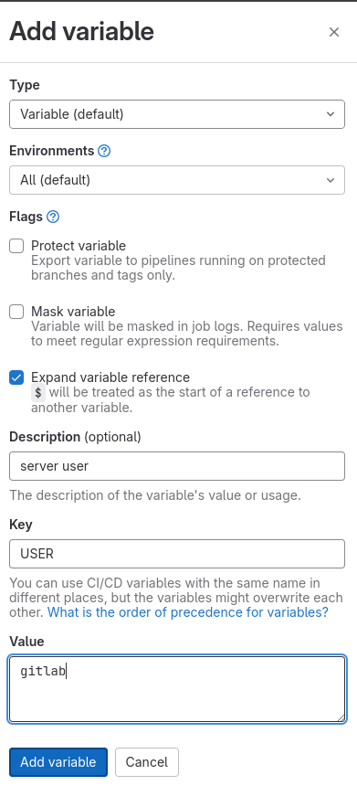
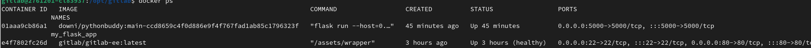

## Выполнила:
## Любова Полина

### В начале:

Зарегестрироваться на https://hub.docker.com/

И в настройках аккаунта выпустить токен:


И также сделать репозиторий pythonbuddy:


### Подготовка виртуальной машины с проектом:

Для работы с гитлаб нужно создать ssh ключ
```sh
ssh-keygen
```

### Подготовка сервера:

##### 1. Закажем сервер на timeweb (4 ядра процессора и 8 гигабайт оперативки), подождем, пока сервер создатся и зайдем в него по SSH.
Для подключения со страницы сервера в таймвеб копируем по порядку отсюда:


   
##### 2. Обновим зависимости и установим докер, проверив потом работу докера:

```sh
apt update && apt upgrade -y

wget -O - https://get.docker.com | bash
apt install docker-compose -y

docker run hello-world
```

##### 3. Для дальнейшей работы сменим порт ssh порт, выключим авторизацию от администратора и перезапустим сервис ssh и создадим пользователя gitlab

```sh
nano /etc/ssh/sshd_config
```

1. Ищем строчку "#Port 22" и меняем ее на "Port 2222"
2. "PermitRootLogin yes" меняем на "PermitRootLogin no"

Из редактора выходим комбинацией: ctrl+s , ctrl+x

```sh
systemctl restart sshd
```

Создаем пользователя и выдаем нужные права:
```sh
adduser gitlab
# Задаем пароль, подверждаем его, пропускаем данные о пользователе и конце подтверждаем

# Права на использование докер и запуск команд от лица администратора
usermod -aG docker gitlab
usermod -aG sudo gitlab

# Перезагрузка, чтобы права на докер работали нормально
reboot now
```

Теперь для подключения к серверу по ssh нужно будет дописывать в команду -p 2222:
```sh
ssh -p 2222 gitlab@<IP адрес>
```
##### 4. Развернем GitLab на выделенном сервере.
   
   **mkdir** - создать папку
   **chown** - поменять владельца и группу владельца папки (-R - рекурсивно)
   **nano** - открыть терминальный текстовый редактор
   
```sh
# Даем право на создание файлов в каталоге /opt/
sudo chmod o+w /opt/
# Создание каталогов для приложений
mkdir /opt/gitlab
# Запись файла для запуска контейнеров
nano /opt/gitlab/docker-compose.yml
```

Запишем следующие данные для запуска gitlab и jenkins на сервере:

```docker-compose
version: '3.6'
services:
  gitlab:
    image: gitlab/gitlab-ee:latest
    hostname: "IP адрес сервера"
    container_name: gitlab
    restart: always
    ports:
      - 80:80
      - 22:22
    volumes:
      - /opt/gitlab/config:/etc/gitlab
      - /opt/gitlab/logs:/var/log/gitlab
      - /opt/gitlab/data:/var/opt/gitlab
    shm_size: '256m'
```

Из редактора выходим комбинацией: ctrl+s , ctrl+x

Запустим gitlab:

```sh
cd /opt/gitlab/
docker-compose up -d
```

На гитлаб заходим по ссылке:
http://<IP адрес сервера>:80  

### Gitlab:

##### 1. Узнаем пароль админа от Gitlab

```sh
docker exec -it gitlab grep 'Password:' /etc/gitlab/initial_root_password
```


Нажать кнопку "Deactivate"
И дальше выключить эти настройки и нажать кнопку "Collapse":


##### 2. Добавим ssh ключ для пользователя, который мы делали на виртуальной машине:

```sh
cat ~/.ssh/id_rsa.pub
```

В Гитлаб открываем настройки пользователя:


И добавляем ключ ssh:


##### 3. Возвращаемся на главную станицу и создает новый проект:


### Поднимем на сервере Gitlab runner

В созданном проекте на гитлабе октрываем настройки:


Копируем команды из инструкции


В один момент в терминале запросится ввод параметров, я ввела такие:


На странице появится активный гитлаб раннер:


После нужно зайти в admin area (снизу слева) и у нашего ранера поставить настройку "Run untagged jobs" активной и сохранить:


Создадим ssh ключ на сервере для гитлаба:

```sh
# Создаем ключ
ssh-keygen -t rsa -b 4096 -C gitlab-runner
# Даем возможность подключаться по ssh к серверу
cat ~/.ssh/id_rsa.pub >> ~/.ssh/authorized_keys
# Читаем приватную часть ключа для добавления в гитлаб
cat ~/.ssh/id_rsa
```

Добавим приватную часть ключа на сервер и другие переменные:





### Подготовим проект и пайплайн для пуша в гитлаб (на виртуалке)

```sh
git clone https://github.com/ethanchewy/PythonBuddy
cd PythonBuddy/
git checkout -b main
```

Создаем докерфайл

```sh
nano Dockerfile
```

В файл вставляем текст:

```Dockerfile
FROM python:3.7.6-buster

ENV FLASK_APP=app.py
COPY ./requirements.txt /tmp/requirements.txt
RUN pip install -r /tmp/requirements.txt && mkdir -p /logs
COPY . /app
WORKDIR /app/PythonBuddy

ENTRYPOINT [ "flask" ]
```

Создаем пайплайн:

```sh
nano .gitlab-ci.yml
```

В файл вставляем текст:

```yml
image:
  name: docker:25.0.3-dind-alpine3.19

services:
  - name: docker:25.0.3-dind-alpine3.19
    alias: docker

stages:
  - build
  - deploy

variables:
  IMAGE_TAG: $DOCKERHUB_USER/pythonbuddy:$CI_COMMIT_REF_SLUG-$CI_COMMIT_SHA
  DOCKER_DRIVER: overlay2
  DOCKER_CERT_PATH: "/certs/client/"
  DOCKER_HOST: tcp://docker:2376
  DOCKER_TLS_VERIFY: 1

build:
  stage: build
  before_script:
    - docker login -u $DOCKERHUB_USER -p $DOCKERHUB_TOKEN
  script:
    - docker info
    - docker build -t $IMAGE_TAG .
    - docker push $IMAGE_TAG
  only:
    - main

deploy:
  stage: deploy
  before_script:
    - apk update && apk add openssh-client
    - eval $(ssh-agent -s)
    - mkdir -p ~/.ssh
    - echo "$SSH_PRIVATE_KEY" | tr -d '\r' | ssh-add -
    - echo -e "Host *\n\tStrictHostKeyChecking no\n\n" > ~/.ssh/config
  script:
    - ssh $SSH_ARGS $USER@$SERVER_IP "docker pull $IMAGE_TAG || true && docker stop my_flask_app && docker rm my_flask_app || true"
    - ssh $SSH_ARGS $USER@$SERVER_IP "docker run -d -p 5000:5000 --name my_flask_app $IMAGE_TAG run --host=0.0.0.0"
  only:
    - main

```

Правим конфиг гитлаб раннера на сервере:

```sh
sudo nano /etc/gitlab-runner/config.toml
```

Меняем только эту часть текст:
```
  [runners.cache]
    MaxUploadedArchiveSize = 0
  [runners.docker]
    tls_verify = false
    image = "docker:25.0.3-dind-alpine3.19"
    privileged = true
    disable_entrypoint_overwrite = false
    oom_kill_disable = false
    disable_cache = false
    volumes = ["/cache", "/certs"]
    shm_size = 0
    network_mtu = 0

```

И перезагружаем раннер командой:
```sh
sudo systemctl restart gitlab-runner.service 
```

Правим зависимости python , чтобы код был рабочим:

```sh
nano requirements.txt
```

Находим зависимости из списка ниже и правим версию:
greenlet == 3.0.2
typed-ast == 1.5.5
flask_socketio == 4.3.1

Вводим команды:

```sh
git config --local user.name "Administrator"
git config --local user.email "admin@example.com"
```

И копируем выделенные две команды из нашего пустого репозитория в гитлабе:


И пишем команду:

```sh
git push -u origin main
```

Проверяем пайлайны в гитлабе:


И после выполнения всех задач делаем docker ps на сервере:



И проверяем 5000 порт в браузере:


